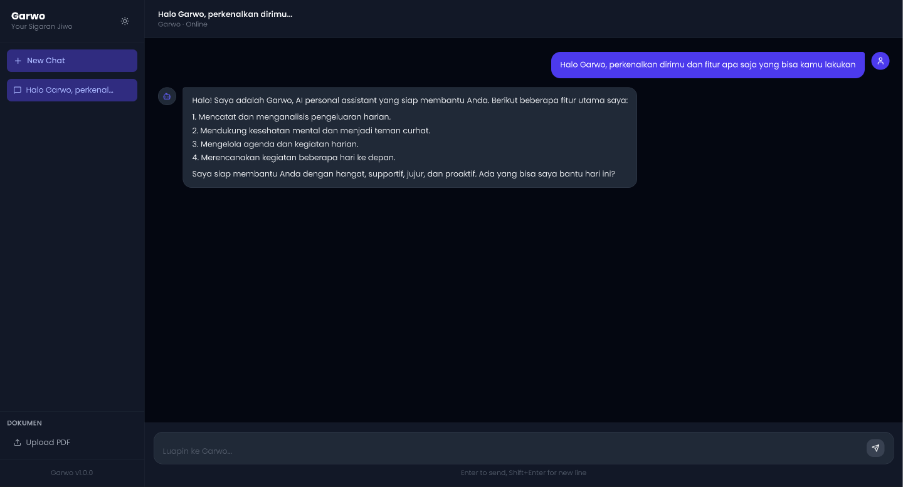

# Garwo — AI Personal Assistant

Garwo is an personal assistant built with a modern, production-grade architecture. It combines a local large language model, retrieval-augmented generation, tool calling, and the Model Context Protocol (MCP) to deliver a capable and extensible assistant for daily life management.

---

## Table of Contents

- [Overview](#overview)
- [Features](#features)
- [Architecture](#architecture)
- [Tech Stack](#tech-stack)
- [Project Structure](#project-structure)
- [Getting Started](#getting-started)
- [MCP Servers](#mcp-servers)
- [Roadmap](#roadmap)

---

## Overview

Garwo assists users in three core areas:

- **Financial tracking** — Log and analyze daily expenses with natural language
- **Schedule management** — Manage agendas synced to Google Calendar
- **Wellness companion** — A conversational partner for mental check-ins and daily reflection

The project is designed as an AI engineering portfolio piece, demonstrating end-to-end system design from LLM inference to MCP-based tool integration.

---

## Features

| Feature | Description |
|---|---|
| Natural language chat | Multi-turn conversation with persistent session history |
| Expense tracking | Log, categorize, and summarize expenses via natural language |
| Agenda management | Create and retrieve schedules with Google Calendar sync |
| RAG | Answer questions from uploaded PDF documents |
| Web search | Retrieve real-time information from the internet via Tavily |
| Telegram integration | Send expense reports and agenda reminders to Telegram |
| Dark mode | Full dark/light theme toggle |
| Markdown rendering | Formatted responses with code blocks, lists, and emphasis |

---

## Architecture

```
┌─────────────────────────────────────────────────────────────┐
│                        Garwo System                          │
├─────────────────────────────────────────────────────────────┤
│                                                               │
│   React Frontend                                             │
│        │                                                      │
│        ▼                                                      │
│   FastAPI Backend ──────────────────────────────────────┐   │
│        │                                                  │   │
│        ├── Context Builder                               │   │
│        │     ├── System Prompt                           │   │
│        │     ├── Conversation History (last 6 messages)  │   │
│        │     ├── RAG Context (ChromaDB)                  │   │
│        │     └── MCP Tool Definitions                    │   │
│        │                                                  │   │
│        ▼                                                  │   │
│   Qwen via Ollama (LLM Inference)                        │   │
│        │                                                  │   │
│        ▼                                                  │   │
│   MCP Client ────────────────────────────────────────────┘   │
│        ├── Expense MCP Server                                 │
│        ├── Agenda MCP Server                                  │
│        ├── Web Search MCP Server                             │
│        ├── Google Calendar MCP Server                        │
│        └── Telegram MCP Server                               │
│                                                               │
│   ChromaDB (Vector Store) ── PDF Documents                   │
│   JSON Files ── Expense & Agenda Data                        │
└─────────────────────────────────────────────────────────────┘
```

---

## Tech Stack

| Layer | Technology |
|---|---|
| Frontend | React, Vite, TailwindCSS |
| Backend | Python, FastAPI |
| LLM | Qwen3 via Ollama |
| AI Protocol | MCP (Model Context Protocol) |
| Vector Database | ChromaDB |
| Embedding Model | nomic-embed-text |
| Web Search | Tavily API |
| Calendar Integration | Google Calendar API |
| Messaging | Telegram Bot API |
| Document Parsing | PyMuPDF |

---

## Project Structure

```
garwo/
├── backend/
│   ├── main.py                  # FastAPI application entry point
│   ├── config.py                # Environment configuration
│   ├── routers/
│   │   ├── chat.py              # Chat endpoint, tool calling, hallucination guard
│   │   └── rag.py               # Document upload and retrieval endpoint
│   └── services/
│       ├── session.py           # Conversation history management
│       ├── embedder.py          # Text embedding via Ollama
│       ├── vector_store.py      # ChromaDB operations
│       └── mcp_client.py        # MCP client and tool router
├── mcp-servers/
│   ├── expense/
│   │   └── server.py            # Expense tracking MCP Server
│   ├── agenda/
│   │   └── server.py            # Agenda management MCP Server
│   ├── websearch/
│   │   └── server.py            # Web search MCP Server (Tavily)
│   ├── gcalendar/
│   │   └── server.py            # Google Calendar MCP Server
│   └── telegram/
│       └── server.py            # Telegram notification MCP Server
└── frontend/
    └── src/
        ├── App.jsx              # Root component, session management
        └── components/
            ├── Sidebar.jsx          # Session list, document upload
            ├── ChatWindow.jsx       # Message display
            ├── MessageBubble.jsx    # Markdown rendering, tool badges, typing animation
            ├── ChatInput.jsx        # Message input
            └── DocumentUpload.jsx   # PDF upload interface
```

---

## Getting Started

### Prerequisites

- Python 3.10 or higher
- Node.js 18 or higher
- Ollama installed and running
- Tavily API key (free tier available at tavily.com)
- Google Cloud project with Calendar API enabled
- Telegram bot token from BotFather

### Installation

**1. Clone the repository**

```bash
git clone https://github.com/YOUR_USERNAME/garwo.git
cd garwo
```

**2. Backend setup**

```bash
cd backend
python -m venv venv

# Windows
venv\Scripts\activate

# macOS/Linux
source venv/bin/activate

pip install -r requirements.txt
```

**3. Frontend setup**

```bash
cd frontend
npm install
```

**4. Environment variables**

Create a `.env` file inside the `backend/` directory:

```env
OLLAMA_BASE_URL=http://localhost:11434
MODEL_NAME=qwen2.5:14b
EMBEDDING_MODEL=nomic-embed-text
APP_NAME=Garwo
TAVILY_API_KEY=your_tavily_api_key
TELEGRAM_BOT_TOKEN=your_telegram_bot_token
TELEGRAM_CHAT_ID=your_telegram_chat_id
```

**5. Pull models**

```bash
ollama pull qwen3.6:27b
ollama pull nomic-embed-text
```

**6. Google Calendar authentication**

```bash
cd mcp-servers/gcalendar
python server.py
```

Follow the browser prompt to authorize Google Calendar access. A `token.json` file will be created automatically.

**7. Run the application**

```bash
# Terminal 1 — Backend
cd backend
uvicorn main:app --reload

# Terminal 2 — Frontend
cd frontend
npm run dev
```

Open **http://localhost:5173** in your browser.

---

## MCP Servers

Garwo uses the Model Context Protocol for all external tool integrations. Each MCP Server runs as an independent subprocess spawned on demand by the backend, requiring no additional terminal windows.

| Server | Tools | Description |
|---|---|---|
| Expense | `save_expense`, `get_expenses`, `delete_expense` | Log and query daily expenses |
| Agenda | `add_agenda`, `get_agenda`, `delete_agenda` | Manage personal schedules |
| Web Search | `search_web`, `get_weather` | Real-time internet search via Tavily |
| Google Calendar | `sync_agenda_to_calendar`, `get_calendar_events`, `delete_calendar_event` | Bidirectional Google Calendar sync |
| Telegram | `send_telegram_message`, `send_expense_report_to_telegram`, `send_agenda_reminder_to_telegram` | Push notifications to Telegram |

---

## Screenshots

### Chat Interface



---

## Author
I am.

---

## License

MIT License
